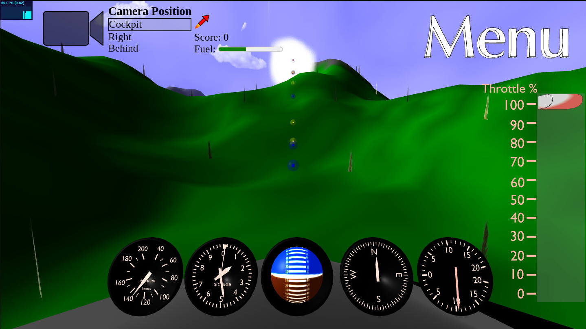
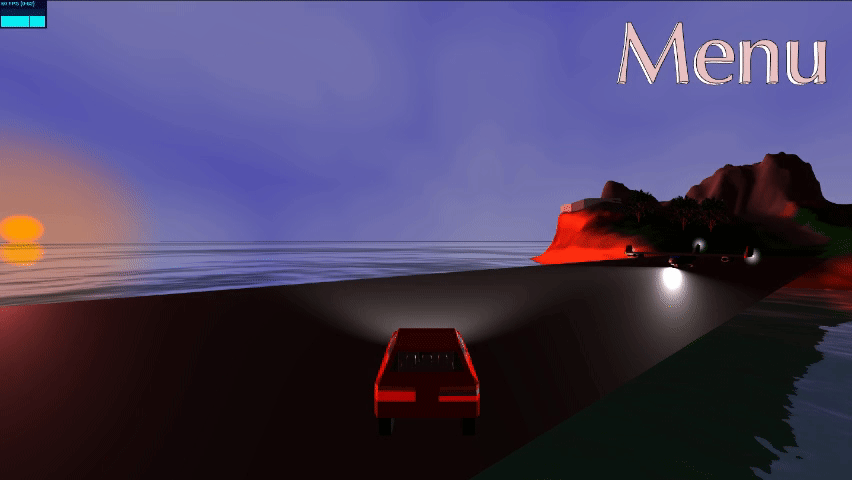
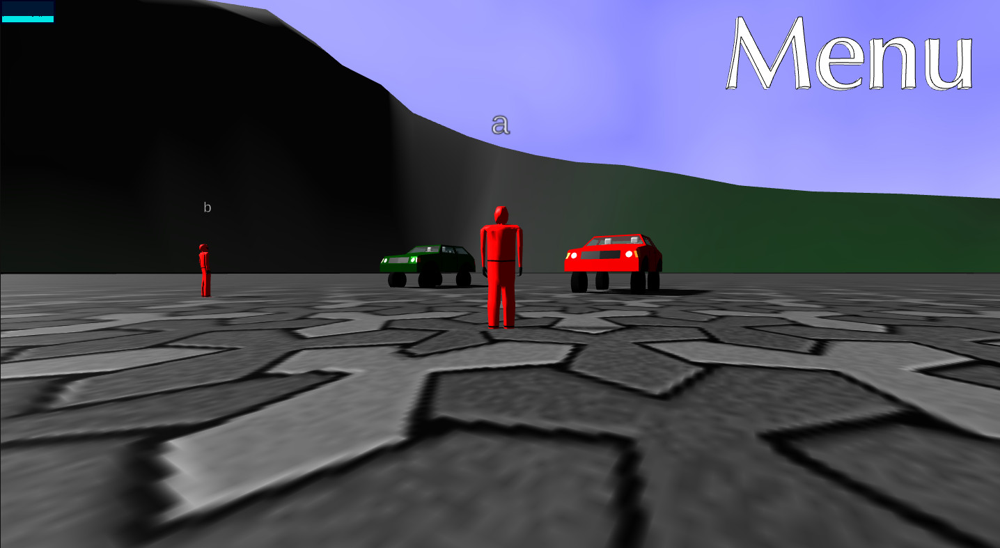

# racing-js
a 3D browser game

## Games

### Flight Over the Mountains

- Press the space bar for tilting the elevator up, release the space bar for tiling the elevator down.
- Press R for using the rockets for boosting the speed.

### Island

- See the controls for walking and the vehicles below.
- Try to pass through as many spheres as possible before the fuel of the airplane finishes.
- The blues spheres fill up the fuel of the airplane.

### Race (Multiplayer)
This game is not finished and will be added later.
#### Preview:

## Controls

### Pilot
- Arrow up: walk
- Arrows left and right: turn
- Space bar: jump
- Number keys: enter a vehicle

### Car
- Arrow up: accelerate
- Arrow down: brake
- Arrows left and right: steering
- E: exit
- S: reset position

### Airplane
- Mouse up and down: elevator
- Mouse left and right: ailerons
- Arrows left and right: rudder, steering
- +, -: increase, deacrease throttle
- E: exit
- S: reset position

## Engine sound
- https://github.com/Antonio-R1/engine-sound-generator

## Third party software used in this game
- [Three.js](https://github.com/mrdoob/three.js)
- [stats.js](https://github.com/mrdoob/stats.js/)
- [ammo.js](https://github.com/kripken/ammo.js/)
